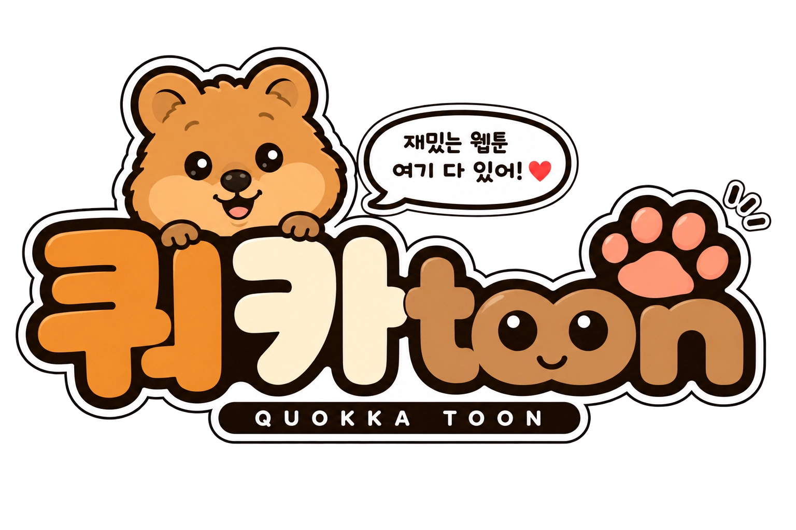

# QuokkaToon | 쿼카툰

<p align="center">
  
</p>

**AI 기반 멀티 플랫폼 웹툰 추천 서비스**

솔데스크 — 자연어 처리(NLP)와 유사도 계산을 활용한 추천 플랫폼 구현 프로젝트

팀원: 이민형(팀장), 이윤학, 이재호, 이태연, 장재원

---

## 서비스 소개

국내 웹툰 시장은 빠르게 성장했지만, 작품 수가 폭발적으로 늘면서 **취향에 맞는 작품을 찾기**는 오히려 어려워졌습니다.  
음악·숙소처럼 “추천”하면 떠오르는 중립 서비스는 웹툰 분야에는 드뭅니다.

**쿼카툰**은 특정 플랫폼에 치우치지 않고, **여러 플랫폼의 웹툰을 한곳에서** 모아  
자연어 검색·취향 기반으로 작품을 추천하는 서비스입니다.

### 이런 독자를 위해

주기적으로 웹툰을 보고 · 플랫폼에 구애받지 않고 · 완결작을 정주행하고 · 캐릭터와 비주얼에 반응하는 독자

| | 유형 | 페르소나 | 니즈 | 쿼카툰 |
|:---:|:---|:---|:---|:---|
|  | **정주행 완주형** | 김서연 · 22 · 대학생 | “이거랑 비슷한 거 또 없나?” | 완결작과 닮은 작품 추천 |
|  | **플랫폼 유목민** | 박지훈 · 31 · 직장인 | “네이버엔 없고 카카오엔 있고” | 다양한 플랫폼을 한 곳에서 |
|  | **감성 탐색형** | 이하늘 · 23 · 취준생 | “잔잔한데 여운 남는 거” | 문장 검색 · 취향 리포트 |

### 핵심 기능

1. **자연어 기반 웹툰 추천** — 문장으로 검색, KoSimCSE + FAISS 유사도, LLM 추천 이유·한 줄 훅·동적 레이더  
2. **취향 리포트** — 인생작·찜·리뷰 기반 개인 취향 분석  
3. **웹툰 상세** — 줄거리·태그·성별/연령 통계·리뷰·미디어 믹스·플랫폼 바로가기  
4. **커뮤니티·알람** — 게시판, 웹툰 연재 알람, 비밀번호 재설정 메일  
5. **관리자** — 신고함, 문의, 벤 관리 등

---

## 기술 스택

| 구분 | 기술 |
|------|------|
| Frontend | React, Vite, Tailwind CSS |
| Backend | Java, Spring Boot, JPA |
| AI | Python, FastAPI, KoSimCSE, FAISS, Gemini |
| Data | MySQL (협업 DB), 웹툰 수집 API (`korea-webtoon-api`) |
| Deploy | Docker Compose (선택) |

---

## 디렉터리 구조

```
Quokka-Toon/
├── front/              # 웹 프론트 (Vite + React)
├── backend/            # Spring Boot API
├── ai/                 # 추천·검색·취향 리포트 API
├── korea-webtoon-api/  # 웹툰 메타 수집 보조 API
├── scripts/            # 유틸·동기화 스크립트
├── compose.yaml        # Docker Compose (선택)
├── .env.example        # 환경 변수 예시
└── README.md
```

로고·아이콘 등 정적 자산은 `front/public/` 에 있습니다.  
메인 로고: `front/public/quokkatoon_logo.png`

---

## 실행 가이드 (로컬)

기본 포트

| 서비스 | 포트 |
|--------|------|
| Frontend | http://localhost:5173 |
| Backend | http://localhost:8080 |
| AI API | http://localhost:8000 |

DB는 팀이 쓰는 **협업 MySQL**을 가정합니다. (`backend/secret.properties` 또는 환경 변수)

### 0. 사전 준비

- Node.js 18+ / npm  
- JDK 17+  
- Python 3.12 권장 (AI)  
- MySQL 접속 정보 (팀 DB 또는 자체 DB)

### 1. 환경 설정

```bash
# 루트
cp .env.example .env
# .env 에 DB·JWT·소셜·GEMINI_API_KEY 등 필요한 값 입력

# 백엔드 시크릿 (커밋하지 말 것)
cd backend
cat > secret.properties <<'EOF'
DB_URL=jdbc:mysql://HOST:3306/quokkatoon?serverTimezone=Asia/Seoul&characterEncoding=UTF-8&useSSL=false&allowPublicKeyRetrieval=true
DB_USERNAME=...
DB_PASSWORD=...
JWT_SECRET=최소32자이상의랜덤문자열
EOF
cd ..
```

소셜 로그인·메일을 쓰지 않아도 기본 목록/상세/검색 UI는 동작할 수 있습니다.  
AI 추천 이유·훅은 `GEMINI_API_KEY`와 `models/`(FAISS·메타)가 필요합니다.

### 2. Frontend

```bash
cd front
npm install
npm run dev
# → http://localhost:5173
```

Vite 프록시는 백엔드 `8080`을 기대합니다.

### 3. Backend

```bash
cd backend
./gradlew bootRun
# → http://localhost:8080
```

포트가 이미 사용 중이면 새 프로세스를 띄우지 말고 기존 서버를 재사용하세요.

### 4. AI (추천 API)

```bash
cd ai
python3.12 -m venv .venv
source .venv/bin/activate   # Windows: .venv\Scripts\activate
pip install -r requirements.txt

# 모델 파일이 프로젝트 루트 models/ 에 있어야 합니다.
# (webtoon_index.faiss, webtoon_meta.pkl 등 — 팀에서 별도 배포)
export GEMINI_API_KEY=...
./run.sh
# 또는 프로젝트 루트에서:
# uvicorn ai.api:app --host 0.0.0.0 --port 8000
```

모델이 없으면 `/health`는 `missing-models`일 수 있고, 추천 API는 제한적으로 동작합니다.

### 5. (선택) Docker Compose

```bash
cp .env.example .env   # 값 채우기
docker compose up -d --build
```

협업 MySQL을 쓰므로 기본 compose는 외부 DB를 가리킵니다.  
로컬 MySQL 컨테이너가 필요하면 `--profile with-mysql` 을 사용합니다.

---

## 제출 패키지 안내

이 README가 포함된 zip은 **실행·빌드에 필요한 소스와 설정 예시** 위주입니다.

포함하지 않은 것(예시):

- `.git`, `node_modules`, `.venv`, 빌드 산출물 (`dist`, `build`, `.gradle`)
- 시크릿 (`.env`, `backend/secret.properties`)
- 대용량 생성물 (`models/*.faiss`, `*.pkl`, 디자인 초안, 데모 영상 등)

실행에 필요한 DB 스키마·AI 모델·API 키는 팀/환경에 맞게 별도 준비하세요.

---

## 라이선스 · 데이터

웹툰 메타·플랫폼 로고 등은 각 제공처의 권리를 따릅니다.  
본 프로젝트는 교육·포트폴리오 목적의 추천 서비스 구현물입니다.
